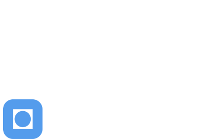
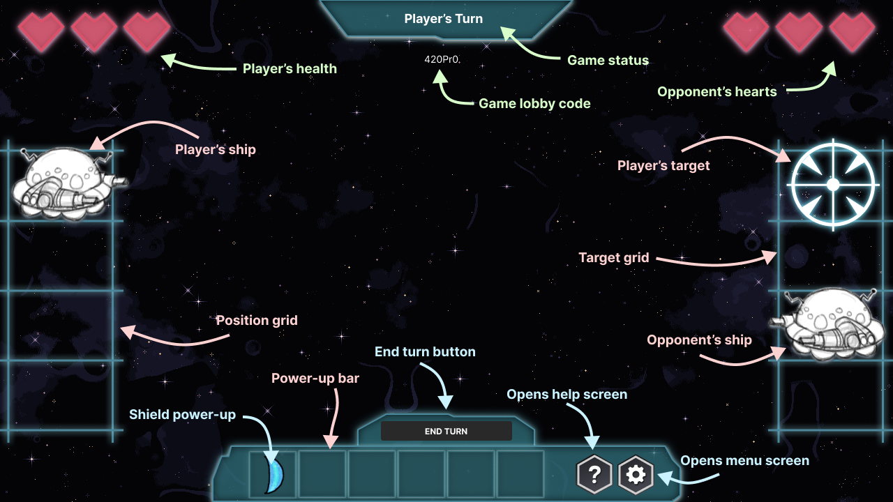

<div align="center">

  
  <h1>Star Battle NTNU</h1>
  
  <p>Intergalactic space warfare - Game project in TDT4240 Software Architecture</p>
  
<!-- Badges -->
<p>
  <a href="https://github.com/WilliamHLe/star-battle-ntnu/graphs/contributors">
    
  </a>
  <a href="https://github.com/WilliamHLe/star-battle-ntnu/network/members">
    
  </a>
  <a href="https://github.com/WilliamHLe/star-battle-ntnu/stargazers">
    
  </a>
  <a href="https://github.com/WilliamHLe/star-battle-ntnu/issues/">
    
  </a>
</p>

<h4>
    <a href="https://youtu.be/35ZzRWoRvt0">View Demo</a>
  </h4>
</div>

<br />


<!-- Table of Contents -->
# Table of Contents

- [About the Project](#about-the-project)
  * [Tech Stack](#tech-stack)
  * [Project Structure](#project-structure)
- [Getting Started](#getting-started)
  * [Prerequisites](#prerequisites)
  * [Installation & Run](#installation-compilling-and-running)

<!-- About the Project -->
## About the Project

<div align="center"> 
  
</div>


<!-- TechStack -->
### Tech Stack

<details>
  <summary>Client</summary>
  <ul>
    <li><a href="https://kotlinlang.org/">Kotlin</a></li>
    <li><a href="https://libgdx.com/">LibGDX</a></li>
    <li><a href="https://github.com/libgdx/ashley">Ashley ECS</a></li>
    <li><a href="https://github.com/kotcrab/vis-ui">VisUI</a></li>
  </ul>
</details>

<details>
  <summary>Server / Database</summary>
  <ul>
    <li><a href="https://firebase.google.com/">Firebase</a></li>
  </ul>
</details>
  
<!-- Project Structure -->
### Project Structure
```
.
├── README.md
├── android
│   ├── AndroidManifest.xml
│   ├── build.gradle
│   ├── res/
│   └── src
│       └── group16
│           └── project
│               └── game
│                   ├── AndroidFirebaseConnection.kt
│                   └── AndroidLauncher.kt
├── assets/
├── build.gradle
├── core
│   ├── build.gradle
│   └── src
│       └── group16
│           └── project
│               └── game
│                   ├── Configuration.kt
│                   ├── StarBattle.kt
│                   ├── ecs
│                   │   ├── Engine.kt
│                   │   ├── Utils.kt
│                   │   ├── component
│                   │   │   ├── BodyComponent.kt
│                   │   │   ├── HealthComponent.kt
│                   │   │   ├── HealthListener.kt
│                   │   │   ├── HeartDisplayComponent.kt
│                   │   │   ├── PlayerComponent.kt
│                   │   │   ├── PositionComponent.kt
│                   │   │   ├── ShieldComponent.kt
│                   │   │   ├── TextureComponent.kt
│                   │   │   ├── TrajectoryComponent.kt
│                   │   │   ├── TransformComponent.kt
│                   │   │   └── TypeComponent.kt
│                   │   ├── system
│                   │   │   ├── HeartSystem.kt
│                   │   │   ├── PositioningSystem.kt
│                   │   │   ├── RenderingSystem.kt
│                   │   │   ├── ShieldSystem.kt
│                   │   │   └── ShootingSystem.kt
│                   │   └── utils
│                   │       ├── ComponentMapper.kt
│                   │       ├── EntityFactory.kt
│                   │       └── InputHandler.kt
│                   ├── models
│                   │   ├── FirebaseInterface.kt
│                   │   ├── Game.kt
│                   │   ├── GameInfo.kt
│                   │   └── GameState.kt
│                   └── views
│                       ├── CreateLobbyScreen.kt
│                       ├── GameScreen.kt
│                       ├── JoinLobbyScreen.kt
│                       ├── LeaderboardScreen.kt
│                       ├── MainMenuScreen.kt
│                       ├── SkinScreen.kt
│                       ├── TextureHandler.kt
│                       ├── View.kt
│                       └── components
│                           ├── EndGameComponent.kt
│                           ├── ImageSlideshowComponent.kt
│                           ├── PopupComponent.kt
│                           ├── SkinComponent.kt
│                           └── SlideshowComponent.kt
├── gradle/
├── gradle.properties
├── gradlew
├── gradlew.bat
└── settings.gradle
```

<!-- Getting Started -->
## Getting Started

<!-- Prerequisites -->
### Prerequisites

- Android device with API version 32 or later or use Android emulator
- The device has to support Google Play Service
- JDK 15 when running on an IDE

<!-- Installation -->
### Installation, compilling and running

#### Installing on Android Studio or IntelliJ
- Clone project from GitHub repository: https://github.com/WilliamHLe/star-battle-ntnu.git
- Setup a virtual device by opening AVD manager in the IDE
- Follow the instructions to setup the device
- Build project
- Run the app

#### Installing on an Android device
- Download the APK file from https://github.com/WilliamHLe/star-battle-ntnu/releases/latest
- Install it on your Android device
- Run the app
